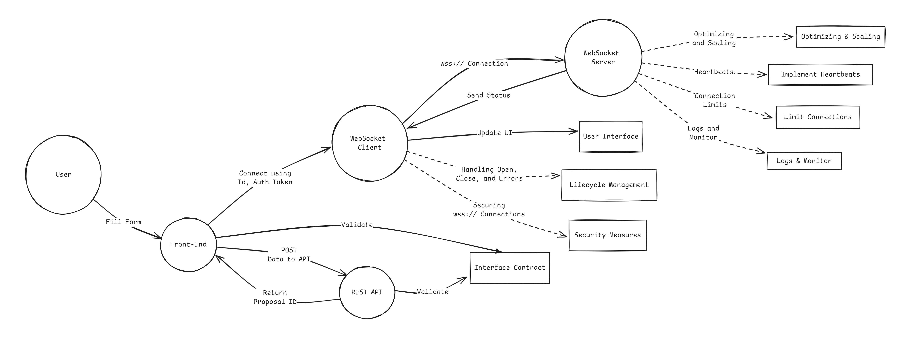

# WebSocket Project



## Overview

This project consists of a WebSocket server and a client application. The server is built with Node.js, Express, and Socket.IO, while the client is a Next.js application using TypeScript.

## Project Structure

- **web-client**: Contains the client-side application.
- **web-server**: Contains the server-side application.

## Getting Started

### Prerequisites

Make sure you have the following installed:

- Node.js (v18.x or higher)
- Yarn (v1.x)

### Installation

1. Clone the repository:

   ```bash
   git clone <repository-url>
   cd <repository-directory>
   ```

2. Install the dependencies for the entire project:

   ```bash
   yarn install
   ```

### Running the Project

To run both the server and client simultaneously, use the following command from the root directory:

```bash
yarn start
```

This command will start the WebSocket server and the Next.js client in parallel.

#### WebSocket Server

The server will be accessible at `http://localhost:4000`.

**Server Files:**
- `web-server/index.js`: Main server script.
- `web-server/index.html`: HTML file served by the server.
- `web-server/package.json`: Dependencies and scripts for the server.

**Starting the Server:**

To start the server individually, navigate to the `web-server` directory and run:

```bash
yarn server
```

#### WebSocket Client

The client will be accessible at `http://localhost:9000`.

**Client Files:**
- `web-client/src/app/page.tsx`: Main React component for the client.
- `web-client/src/utils/socket.ts`: Utility for initializing the WebSocket connection.
- `web-client/package.json`: Dependencies and scripts for the client.

**Starting the Client:**

To start the client individually, navigate to the `web-client` directory and run:

```bash
yarn dev
```

## Project Details

### WebSocket Server (`web-server`)

The server uses Express and Socket.IO to handle WebSocket connections and serve an HTML file.

- **Port:** 4000
- **CORS Configuration:** Allows requests from `http://localhost:9000`
- **Authentication:** Requires a specific token (`ZXhhbXBsZS10b2tlbi0xMjM0NTY=`) = `example-token-123456`

**Endpoints:**

- `GET /`: Serves the `index.html` file.

**Socket.IO Events:**

- `chat message`: Broadcasts chat messages to all connected clients.

### WebSocket Client (`web-client`)

The client is built with Next.js and uses Socket.IO client to connect to the WebSocket server.

- **Port:** 9000

**Features:**

- Displays a list of messages received from the server.
- Allows users to send messages to the server.

**Utilities:**

- `initializeSocket(token: string)`: Initializes the WebSocket connection with the given token.
- `getSocket()`: Retrieves the current socket instance.

## Troubleshooting

- **Server not starting:** Ensure you have installed all dependencies and there are no port conflicts.
- **Client not connecting:** Verify that the server is running and the token is correct.
